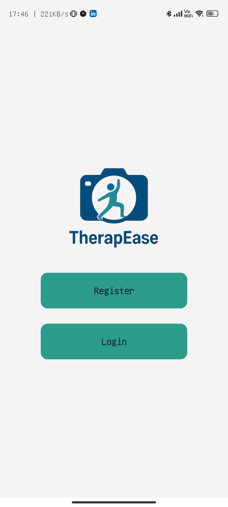
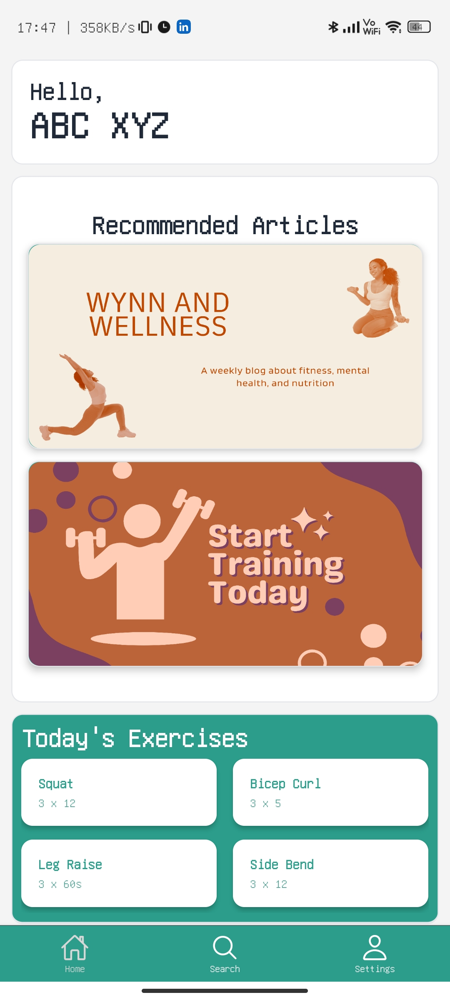
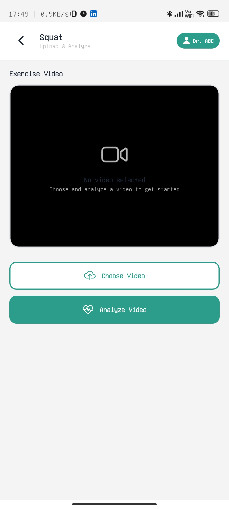
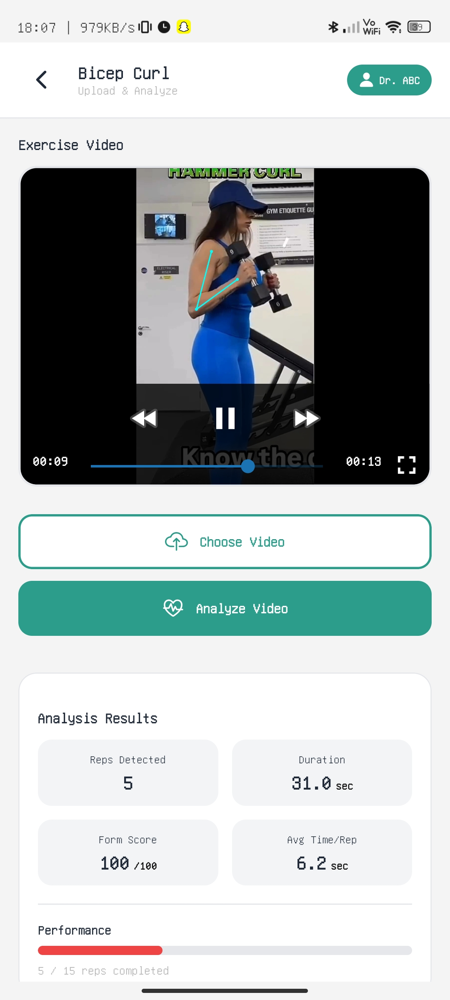
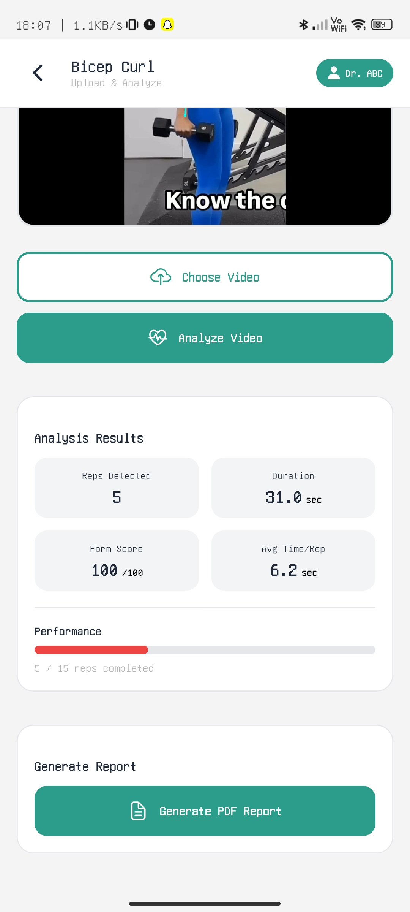
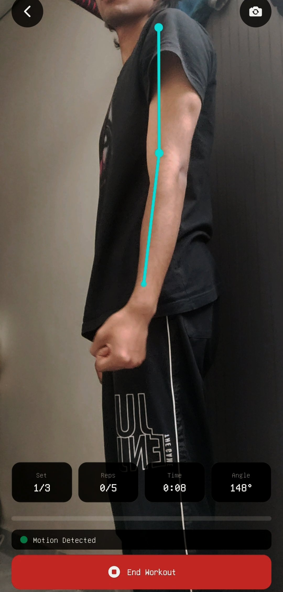
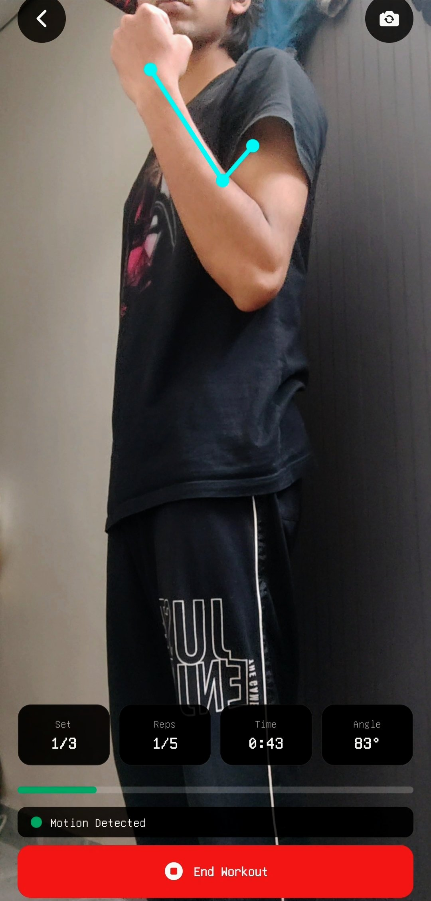
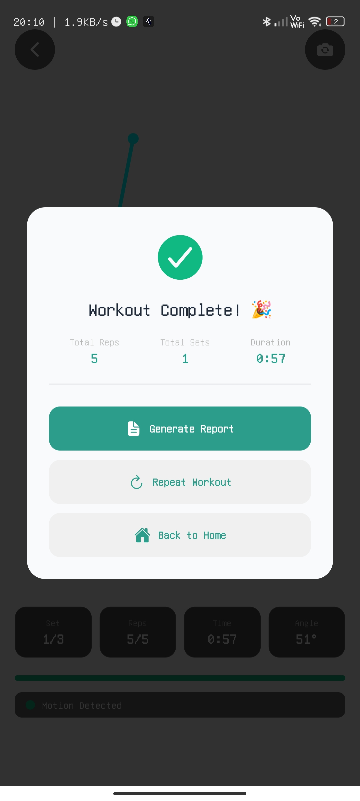

# 🚀 Therap-Ease  
### *AI-Powered Physiotherapy Tracking & Remote Recovery System*

Therap-Ease is an intelligent physiotherapy platform designed to modernize exercise tracking, patient monitoring, and remote therapy. It uses **AI pose estimation**, **real-time movement analysis**, and **automated progress reporting** to make therapy accessible, accurate, and efficient from anywhere.

---

## ✨ Features

### 🎥 **AI-Based Exercise Tracking**
- Detects body landmarks using MediaPipe Pose  
- Live joint-angle calculation  
- Automatic repetition counter  
- Form-correction alerts and posture feedback  

### 📊 **Progress Reporting**
- Generates detailed PDF reports  
- Shows reps, form score, speed, and angle patterns  
- Tracks improvement across sessions  

### 🧑‍⚕️ **Doctor Dashboard**
- Manage patient prescriptions  
- Adjust exercises remotely  
- View all reports and history  

### 👤 **Patient Portal**
- Guided exercise sessions  
- Real-time visual feedback  
- Easy navigation and simple UI for all age groups  

### 🔒 **Secure & Reliable**
- Encrypted data handling  
- Privacy-focused workflow  
- Fully compatible with mobile devices  

---

## 🛠️ Tech Stack

| Layer | Tools |
|------|-------|
| **Mobile App** | React Native (Expo), Axios, SVG |
| **Backend** | FastAPI, Python |
| **Pose Estimation** | MediaPipe Pose, OpenCV, NumPy |
| **Reporting** | FPDF |

---

## 📷 App Screenshots
### Authentication & Home
<p align="center">   </p> <p align="center"> <b>Login Screen</b> &nbsp;&nbsp;&nbsp;&nbsp;&nbsp;&nbsp;&nbsp;&nbsp;&nbsp;&nbsp;&nbsp;&nbsp;&nbsp;&nbsp;&nbsp;&nbsp;&nbsp;&nbsp;&nbsp;&nbsp;&nbsp;&nbsp;&nbsp;&nbsp;&nbsp;&nbsp;&nbsp;&nbsp;&nbsp;&nbsp;&nbsp;&nbsp;&nbsp;&nbsp; <b>Home Dashboard</b> </p>

### Upload & Exercise Tracking
<p align="center">    </p> <p align="center"> <b>Upload Video</b> &nbsp;&nbsp;&nbsp;&nbsp;&nbsp;&nbsp; <b>Tracked Exercise</b> &nbsp;&nbsp;&nbsp;&nbsp;&nbsp;&nbsp; <b>Exercise Results</b> </p>

### Live Pose Tracking
<p align="center">   </p> <p align="center"> <b>Live Tracking</b> &nbsp;&nbsp;&nbsp;&nbsp;&nbsp;&nbsp;&nbsp;&nbsp;&nbsp;&nbsp;&nbsp;&nbsp;&nbsp;&nbsp;&nbsp;&nbsp;&nbsp;&nbsp;&nbsp;&nbsp;&nbsp;&nbsp;&nbsp;&nbsp;&nbsp;&nbsp;&nbsp;&nbsp;&nbsp;&nbsp;&nbsp;&nbsp;&nbsp; <b>Real-Time Pose Detection</b> </p>

### Workout Completion
<p align="center">  </p> <p align="center"> <b>Workout Completed Screen</b> </p>
---

## 📦 Getting Started

Follow these steps to run Therap-Ease locally.

### **1️⃣ Clone the Repository**
```bash
git clone https://github.com/CouchPtato/Therapease.git
cd Therapease/Therap-Ease
